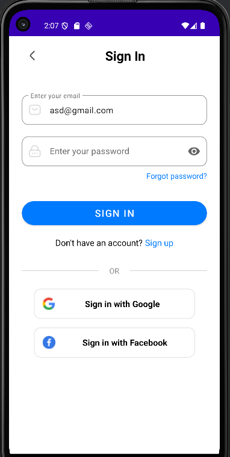
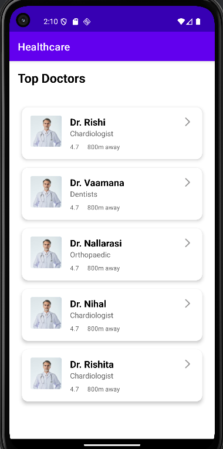
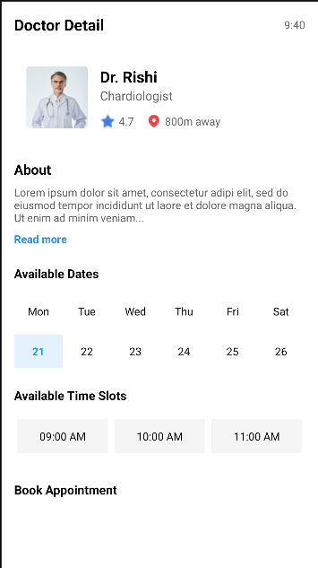
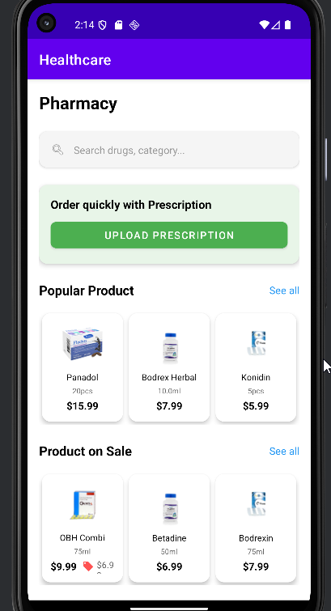
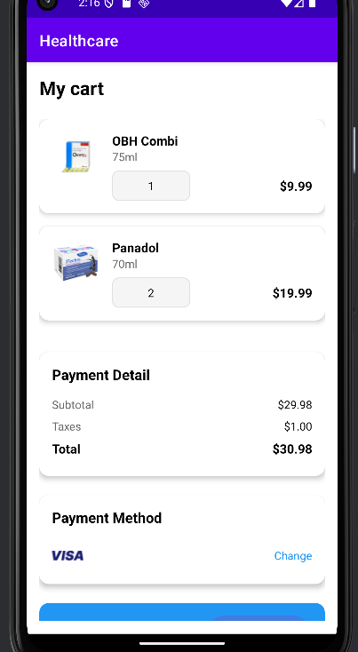
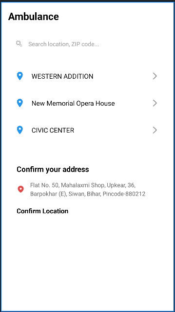
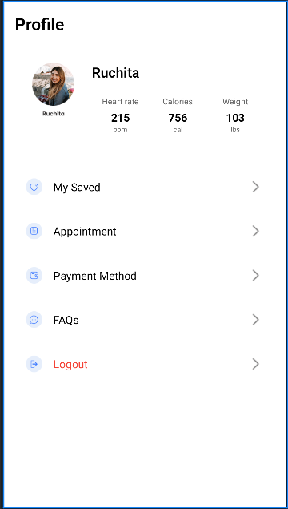

# HealthcareApp
Приложение для здравоохранения с врачами, аптекой и скорой помощью (Android Java)

## Основные функции
- Splash, онбординг, авторизация (вход/регистрация)
- Главный экран с BottomNavigation (Главная, Отчёты, Уведомления, Профиль)
- Поиск и детали врачей
- Аптека с товарами, деталями и корзиной
- Оформление заказа и экран успешной оплаты
- Вызов скорой помощи
- RecyclerView для списков врачей и товаров
- Гибридная навигация (Activity + Fragments)

## Технологии
- Java
- Multiple Activities + Fragments
- BottomNavigationView
- RecyclerView + Adapters
- SharedPreferences
- Material Design

## Скриншоты

## Как запустить
1. Откройте проект в Android Studio
2. Запустите на эмуляторе или устройстве

Учебная практика (2025).
